# Sudarshan AI (CyberRabbit v7.12.9)
## Technical Architecture, Data Flow & Algorithm Reference
**Prepared by:** Senior Developer & CTO  
**Date:** 2026-06-25  
**Classification:** Internal Engineering Reference  

---

## Table of Contents

1. [Diagram 1 — System Component Architecture](#diagram-1--system-component-architecture)
2. [Diagram 2 — Frontend Component Hierarchy](#diagram-2--frontend-component-hierarchy)
3. [Diagram 3 — Backend Module Dependency Graph](#diagram-3--backend-module-dependency-graph)
4. [Diagram 4 — Primary Chat Request Data Flow (Sequence)](#diagram-4--primary-chat-request-data-flow-sequence)
5. [Diagram 5 — Background Summary Generation Flow](#diagram-5--background-summary-generation-flow)
6. [Diagram 6 — Security Gateway Decision Chain (Flowchart)](#diagram-6--security-gateway-decision-chain-flowchart)
7. [Diagram 7 — Prompt Injection Scoring Algorithm](#diagram-7--prompt-injection-scoring-algorithm)
8. [Diagram 8 — Budget Guard State Machine](#diagram-8--budget-guard-state-machine)
9. [Diagram 9 — HMAC-SHA256 Authentication Algorithm](#diagram-9--hmac-sha256-authentication-algorithm)
10. [Diagram 10 — Intelligence Engine Pipeline](#diagram-10--intelligence-engine-pipeline)
11. [Diagram 11 — Severity Classification & Wildcard Matcher Algorithm](#diagram-11--severity-classification--wildcard-matcher-algorithm)
12. [Diagram 12 — LLM Provider Abstraction & Routing](#diagram-12--llm-provider-abstraction--routing)
13. [Diagram 13 — PII Redaction Pipeline](#diagram-13--pii-redaction-pipeline)
14. [Diagram 14 — Client-Side State & Session Persistence](#diagram-14--client-side-state--session-persistence)
15. [Diagram 15 — Full End-to-End System Data Flow (Entity Relationship)](#diagram-15--full-end-to-end-system-data-flow-entity-relationship)

---

## Diagram 1 — System Component Architecture

**Name:** `ARCH-01 — High-Level System Component Architecture`  
**Purpose:** Shows all major subsystems and their physical boundaries — frontend, gateway, backend core, intelligence engine, and LLM providers.

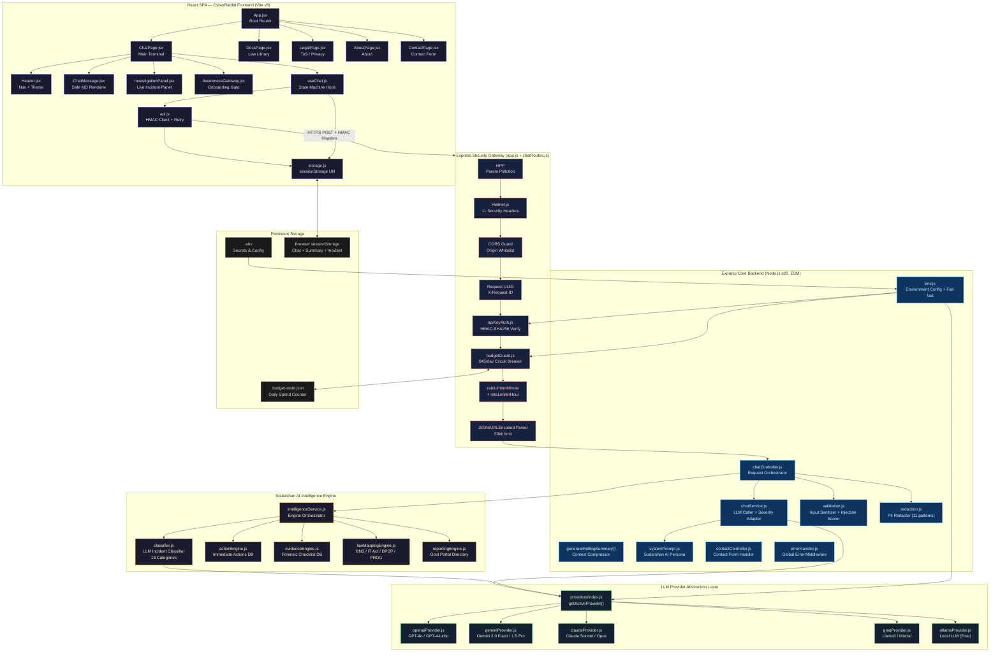

---

## Diagram 2 — Frontend Component Hierarchy

**Name:** `ARCH-02 — React Component Tree & Data Bindings`  
**Purpose:** Shows the React component parent-child relationships, which component owns which state, and which use the `useChat` hook.

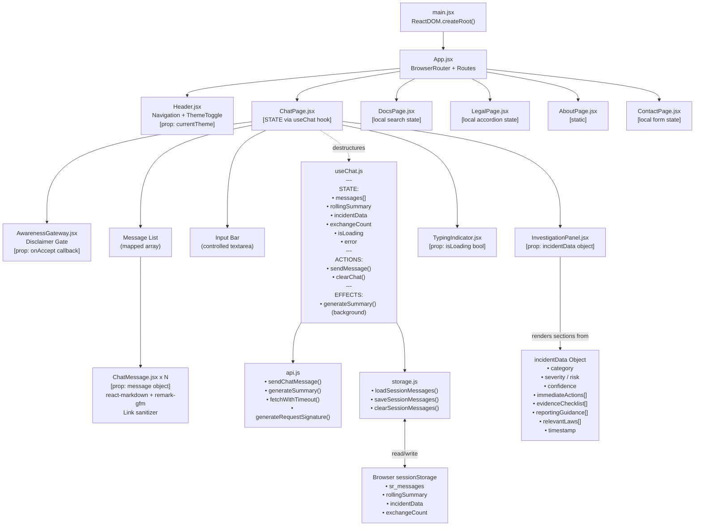

---

## Diagram 3 — Backend Module Dependency Graph

**Name:** `ARCH-03 — Backend Module Import & Dependency Graph`  
**Purpose:** Shows every import relationship in the Node.js backend so the dependency chain is unambiguous.

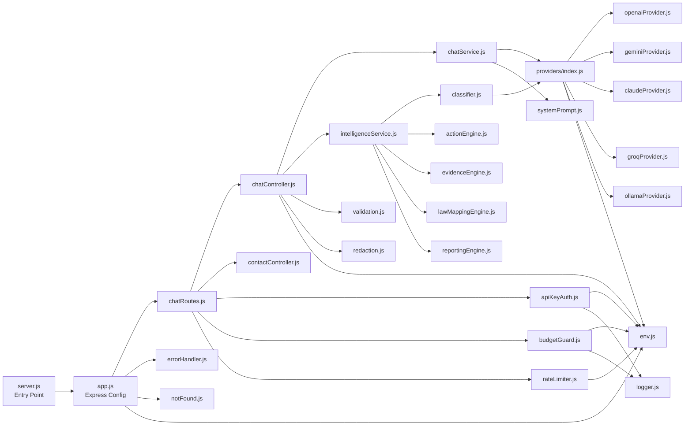

---

## Diagram 4 — Primary Chat Request Data Flow (Sequence)

**Name:** `SEQ-01 — End-to-End Chat Message Sequence Diagram`  
**Purpose:** The authoritative sequence diagram tracing one user message from browser keystroke to rendered reply, including every actor, every decision point, and parallel branches.

```mermaid
sequenceDiagram
    autonumber
    actor USR as User Browser
    participant HOOK as useChat.js
    participant API as api.js
    participant GW as Express Gateway
    participant AUTH as apiKeyAuth.js
    participant BUDGET as budgetGuard.js
    participant RATE as rateLimiter.js
    participant CTRL as chatController.js
    participant VAL as validation.js
    participant REDACT as redaction.js
    participant CHAT as chatService.js
    participant INTEL as intelligenceService.js
    participant CLS as classifier.js
    participant ENGINES as actionEngine / evidenceEngine / lawMapping / reportingEngine
    participant LLM as LLM Provider API

    USR->>HOOK: sendMessage(inputText)
    Note over HOOK: Trim input; guard isLoading
    HOOK->>HOOK: Pack recentMessages (last 4)
    HOOK->>HOOK: Optimistic UI update (append user bubble)
    HOOK->>HOOK: setIsLoading(true)

    HOOK->>API: sendChatMessage(message, rollingSummary, recentMessages, incidentData, exchangeCount)

    Note over API: generateRequestSignature()
    API->>API: timestamp = floor(Date.now()/1000)
    API->>API: payload = "timestamp:POST:/chat"
    API->>API: HMAC-SHA256(payload, VITE_API_KEY) via Web Crypto API
    API->>API: Attach X-API-Key, X-Request-Timestamp, X-Request-Signature

    API->>GW: POST /chat (JSON body + auth headers, 50kb limit, 20s timeout)

    Note over GW: Global middleware chain
    GW->>GW: HPP — strip duplicate params
    GW->>GW: Helmet — enforce 11 security headers
    GW->>GW: CORS — validate origin whitelist
    GW->>GW: Assign X-Request-ID (UUID)

    GW->>AUTH: apiKeyAuth(req, res, next)
    AUTH->>AUTH: Check X-API-Key === env.apiSecretKey
    AUTH->>AUTH: Verify |now - X-Request-Timestamp| < 30s
    AUTH->>AUTH: Reconstruct HMAC & timingSafeEqual compare
    alt Auth Failure
        AUTH-->>API: 401/403 Authentication required
        API-->>HOOK: throws ApiError
        HOOK-->>USR: Display error banner
    end

    AUTH->>BUDGET: budgetGuard(req, res, next)
    BUDGET->>BUDGET: readBudgetState() from .budget-state.json
    BUDGET->>BUDGET: Reset if date changed (UTC)
    BUDGET->>BUDGET: Increment count & cost by provider rate
    alt Budget Exceeded ($45/day)
        BUDGET-->>API: 503 Daily API budget exhausted
        API-->>HOOK: throws ApiError
        HOOK-->>USR: Display error banner
    end
    BUDGET->>BUDGET: writeBudgetState()

    BUDGET->>RATE: chatRateLimiterMinute then chatRateLimiterHour
    alt Rate Limit Hit
        RATE-->>API: 429 Too Many Requests
        API-->>HOOK: throws ApiError (retries 2x with backoff)
        HOOK-->>USR: Display error banner
    end

    RATE->>CTRL: postChat(req, res, next)

    CTRL->>VAL: validateChatPayload(req.body)
    Note over VAL: 1. Type-check all fields<br/>2. Strip zero-width Unicode chars<br/>3. Map Cyrillic homoglyphs to Latin<br/>4. Decode leet-speak (0→o, 1→l ...)<br/>5. Score injection patterns<br/>6. Throw 400 if score ≥ 8<br/>7. Whitelist-sanitize incidentData<br/>8. Cap recentMessages at 10<br/>9. Cap rollingSummary at 5000 chars<br/>10. Cap exchangeCount at 100
    alt Injection Detected (score ≥ 8)
        VAL-->>API: 400 Security filter triggered
    end
    VAL-->>CTRL: sanitized payload

    CTRL->>CTRL: assessInitialSeverity(message)
    Note over CTRL: Two-pass wildcard regex<br/>HIGH keywords checked FIRST<br/>Then LOW keywords<br/>Returns: HIGH | LOW | UNKNOWN

    CTRL->>REDACT: redactSensitiveData(rollingSummary)
    Note over REDACT: 11 regex passes:<br/>Credit card, API keys, Email,<br/>OTP/PIN, Aadhaar, PAN,<br/>Mobile, IPv4, IPv6, UPI, IFSC

    par LLM Response (always runs)
        CTRL->>CHAT: getChatResponse(message, severity, redactedSummary, recentMessages)
        CHAT->>CHAT: Adapt maxTokens by severity<br/>LOW=500 | MEDIUM=1024 | CRITICAL=2048
        CHAT->>CHAT: Append SEVERITY_HINT to system prompt
        CHAT->>LLM: generateResponse(systemPrompt, summary, history, message, maxTokens)
        LLM-->>CHAT: reply text + usage metadata
        CHAT->>CHAT: logProviderUsage(action, result, startTime)
        CHAT-->>CTRL: reply string
    and Intelligence Engine (runs if severity triggers or exchangeCount threshold)
        CTRL->>INTEL: processIntelligence(redactedSummary, recentMessagesText)
        INTEL->>CLS: classifyIncident(summary, recentText)
        CLS->>LLM: generateStructuredData(CLASSIFICATION_PROMPT, userPrompt)
        LLM-->>CLS: Raw JSON string
        CLS->>CLS: Strip markdown wrapper if present
        CLS->>CLS: JSON.parse() → {category, severity, risk, status, confidence}
        alt confidence < 70
            CLS-->>INTEL: {classified: false, confidence}
            INTEL-->>CTRL: low-confidence stub
        end
        CLS-->>INTEL: classification object
        INTEL->>ENGINES: getImmediateActions(category)
        INTEL->>ENGINES: getEvidenceChecklist(category)
        INTEL->>ENGINES: getReportingGuidance(category)
        INTEL->>ENGINES: getRelevantLaws(category)
        ENGINES-->>INTEL: deterministic local DB lookups
        INTEL-->>CTRL: full intelligencePayload
    end

    CTRL-->>API: 200 JSON {success, data: {reply, incidentData}}

    API->>API: Validate response shape
    API-->>HOOK: {reply, incidentData}

    HOOK->>HOOK: if incidentData.classified → setIncidentData()
    HOOK->>HOOK: Save incidentData to sessionStorage
    HOOK->>HOOK: Increment exchangeCount, persist
    HOOK->>HOOK: Append assistantMessage to messages[]
    HOOK->>HOOK: persist(finalMessages) → sessionStorage
    HOOK->>HOOK: setIsLoading(false)
    HOOK-->>USR: Render assistant bubble (react-markdown, link-sanitized)
    HOOK-->>USR: If incidentData → InvestigationPanel updates

    Note over HOOK,API: Background — Fire & Forget (non-blocking)
    HOOK--)API: generateSummary(rollingSummary, [user+assistant])
    API--)LLM: POST /chat/summary (15s timeout)
    LLM--)API: compressed summary text
    API--)HOOK: newSummary string
    HOOK--)HOOK: setRollingSummary(newSummary)
    HOOK--)HOOK: sessionStorage.setItem('rollingSummary', newSummary)
```

---

## Diagram 5 — Background Summary Generation Flow

**Name:** `SEQ-02 — Rolling Summary Compression Pipeline`  
**Purpose:** Isolates the asynchronous background memory compression that runs after every exchange, keeping the LLM context window lean across long sessions.

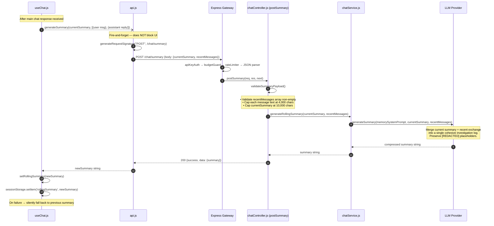

---

## Diagram 6 — Security Gateway Decision Chain (Flowchart)

**Name:** `FLOW-01 — Security Middleware Decision Chain`  
**Purpose:** A complete flowchart of every pass/fail decision gate a request must clear before reaching business logic.

```mermaid
flowchart TD
    START([HTTP Request Arrives]) --> HPP

    HPP[HPP: Remove duplicate\nquery/body params]
    HPP --> HELMET

    HELMET[Helmet: Apply 11 security headers\nCSP / HSTS / X-Frame-Options /\nPermissions-Policy / Referrer-Policy]
    HELMET --> CORS_CHK

    CORS_CHK{Origin in\nallowed list?}
    CORS_CHK -- Yes --> UUID_GEN
    CORS_CHK -- No --> CORS_ERR[403 CORS Error]

    UUID_GEN[Generate X-Request-ID\ncrypto.randomUUID()]
    UUID_GEN --> HDR_CHK

    HDR_CHK{X-API-Key +\nX-Request-Timestamp +\nX-Request-Signature\npresent?}
    HDR_CHK -- No --> AUTH_FAIL_1[401 Authentication required]
    HDR_CHK -- Yes --> KEY_CHK

    KEY_CHK{X-API-Key ===\nenv.apiSecretKey?}
    KEY_CHK -- No --> AUTH_FAIL_2[403 Invalid credentials]
    KEY_CHK -- Yes --> TS_CHK

    TS_CHK{|now - timestamp|\n< 30 seconds?}
    TS_CHK -- No --> AUTH_FAIL_3[403 Timestamp expired]
    TS_CHK -- Yes --> SIG_CHK

    SIG_CHK["Reconstruct HMAC-SHA256\nPayload: timestamp:METHOD:path\nCompare via timingSafeEqual()"]
    SIG_CHK --> SIG_VALID{Signatures\nmatch?}
    SIG_VALID -- No --> AUTH_FAIL_4[403 Invalid signature]
    SIG_VALID -- Yes --> BUDGET_READ

    BUDGET_READ[Read .budget-state.json\nIf date changed → reset count & cost]
    BUDGET_READ --> COST_CALC

    COST_CALC[cost += providerRate\nopenai:$0.002 gemini:$0.01\nclaude:$0.02 groq:$0.001 ollama:$0]
    COST_CALC --> BUDGET_CHK{cost >\nDAILY_BUDGET_USD\n$45.00?}
    BUDGET_CHK -- Yes --> BUDGET_ERR[503 Daily budget exhausted]
    BUDGET_CHK -- No --> BUDGET_WRITE

    BUDGET_WRITE[Write updated state\nto .budget-state.json]
    BUDGET_WRITE --> RATE_MIN

    RATE_MIN{Under per-minute\nIP rate limit?}
    RATE_MIN -- No --> RATE_ERR[429 Too Many Requests]
    RATE_MIN -- Yes --> RATE_HR

    RATE_HR{Under per-hour\nIP rate limit?}
    RATE_HR -- No --> RATE_ERR
    RATE_HR -- Yes --> PARSE

    PARSE[Parse JSON body\n50kb max size]
    PARSE --> CONTROLLER([Proceed to\nchatController.js])

    style START fill:#1a1a2e,stroke:#6c63ff,color:#fff
    style CONTROLLER fill:#0f3460,stroke:#53d8fb,color:#fff
    style AUTH_FAIL_1,AUTH_FAIL_2,AUTH_FAIL_3,AUTH_FAIL_4 fill:#4a0000,stroke:#f05454,color:#ffd6d6
    style CORS_ERR,BUDGET_ERR,RATE_ERR fill:#4a0000,stroke:#f05454,color:#ffd6d6
```

---

## Diagram 7 — Prompt Injection Scoring Algorithm

**Name:** `ALGO-01 — Prompt Injection Detection & Weighted Scoring Algorithm`  
**Purpose:** Detailed flowchart of the injection detection algorithm in `validation.js` including all normalization steps and the two-tier weighted pattern database.

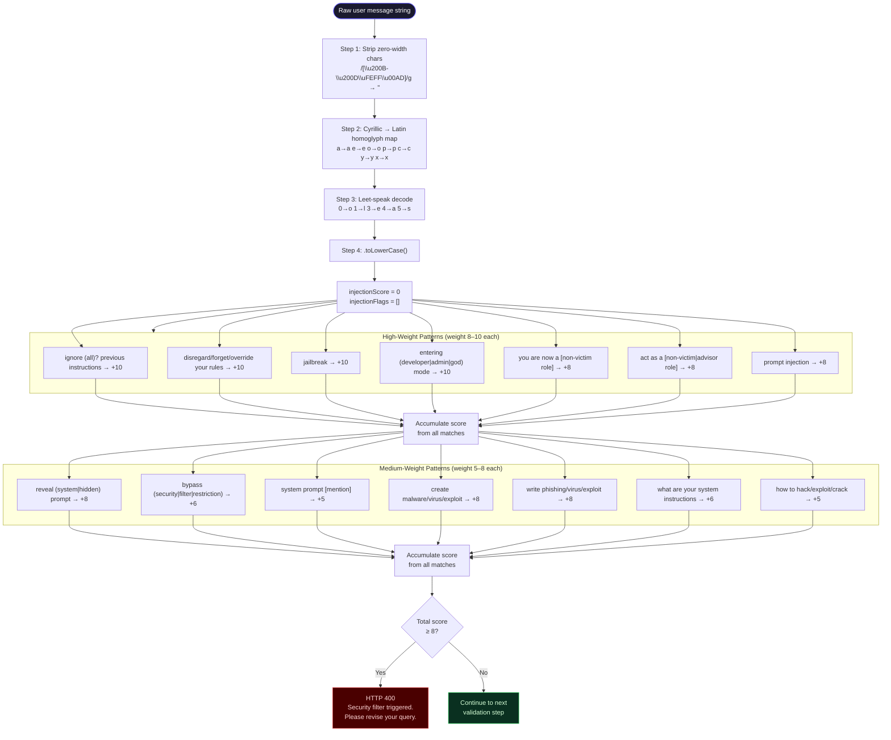

---

## Diagram 8 — Budget Guard State Machine

**Name:** `ALGO-02 — Daily Budget Circuit Breaker State Machine`  
**Purpose:** Models the file-persisted budget guard as a formal state machine showing all state transitions, guard conditions, and side effects.

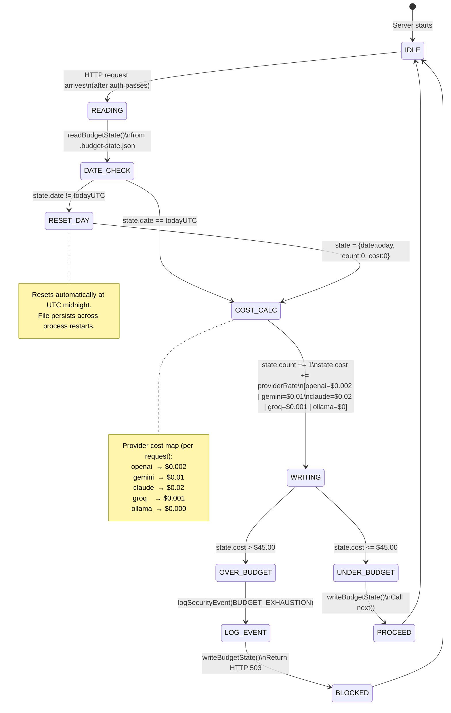

---

## Diagram 9 — HMAC-SHA256 Authentication Algorithm

**Name:** `ALGO-03 — HMAC-SHA256 Dual-Side Authentication Algorithm`  
**Purpose:** Shows the exact algorithm running in parallel on client (Web Crypto API) and server (Node crypto module), including the timing-safe comparison step.

```mermaid
flowchart LR
    subgraph CLIENT ["  Client Side — api.js (Browser Web Crypto API)"]
        C1["timestamp = floor(Date.now()/1000).toString()"]
        C2["urlPath = new URL(url).pathname"]
        C3["signaturePayload = timestamp + ':' + METHOD + ':' + urlPath"]
        C4["keyData = TextEncoder.encode(VITE_API_KEY)"]
        C5["cryptoKey = crypto.subtle.importKey(\n  'raw', keyData, {name:'HMAC',hash:'SHA-256'},\n  false, ['sign']\n)"]
        C6["signatureBuffer = crypto.subtle.sign(\n  'HMAC', cryptoKey, encode(signaturePayload)\n)"]
        C7["signature = hex-encode(Uint8Array(signatureBuffer))"]
        C8["Headers sent:\nX-API-Key: VITE_API_KEY\nX-Request-Timestamp: timestamp\nX-Request-Signature: signature"]
        C1 --> C2 --> C3 --> C4 --> C5 --> C6 --> C7 --> C8
    end

    subgraph SERVER [" Server Side — apiKeyAuth.js (Node.js crypto module)"]
        S1["Extract headers:\nX-API-Key, X-Request-Timestamp, X-Request-Signature"]
        S2{All 3 headers\npresent?}
        S3["Check X-API-Key === env.apiSecretKey"]
        S4{Keys\nmatch?}
        S5["ts = Number(X-Request-Timestamp)\nCheck |Date.now()/1000 - ts| < 30s"]
        S6{Timestamp\nfresh?}
        S7["signaturePayload = timestamp + ':' + req.method + ':' + req.path"]
        S8["expected = crypto.createHmac('sha256', env.apiSecretKey)\n  .update(signaturePayload).digest('hex')"]
        S9["sigBuffer = Buffer.from(receivedSig, 'utf8')\nexpectedBuffer = Buffer.from(expected, 'utf8')"]
        S10{sigBuffer.length ===\nexpectedBuffer.length\nAND timingSafeEqual()?}
        S11["next() — proceed to budgetGuard"]
        FAIL1["401 Missing headers"]
        FAIL2["403 Invalid API key"]
        FAIL3["403 Timestamp expired"]
        FAIL4["403 Invalid signature"]

        S1 --> S2
        S2 -- No --> FAIL1
        S2 -- Yes --> S3 --> S4
        S4 -- No --> FAIL2
        S4 -- Yes --> S5 --> S6
        S6 -- No --> FAIL3
        S6 -- Yes --> S7 --> S8 --> S9 --> S10
        S10 -- No --> FAIL4
        S10 -- Yes --> S11
    end

    C8 -->|"HTTPS Request"| S1

    note1["timingSafeEqual prevents timing side-channel attacks.\nConstant-time comparison regardless of where\nstrings first differ."]
```

---

## Diagram 10 — Intelligence Engine Pipeline

**Name:** `FLOW-02 — Sudarshan AI Intelligence Engine Pipeline`  
**Purpose:** Detailed flowchart of the entire intelligence subsystem — from the LLM-based classifier through the four deterministic lookup engines — showing the confidence gate and all 18 incident categories.

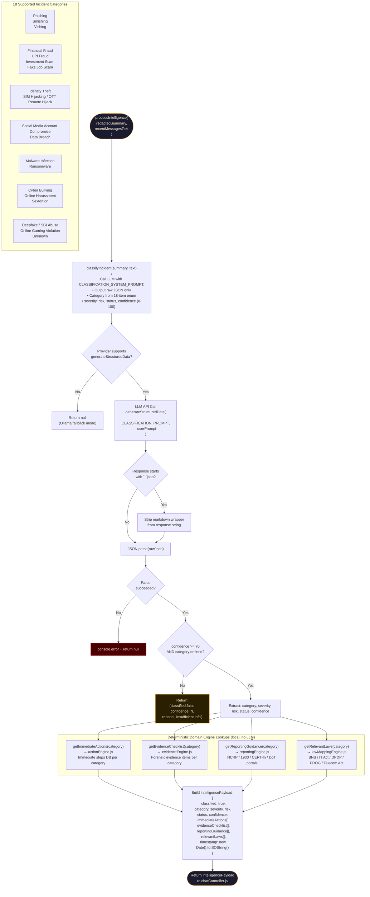

---

## Diagram 11 — Severity Classification & Wildcard Matcher Algorithm

**Name:** `ALGO-04 — Severity Assessment & Natural Language Wildcard Matcher`  
**Purpose:** Details the two-pass keyword matching algorithm that determines severity level from user input, including the wildcard compilation process that enables Hinglish natural language understanding.

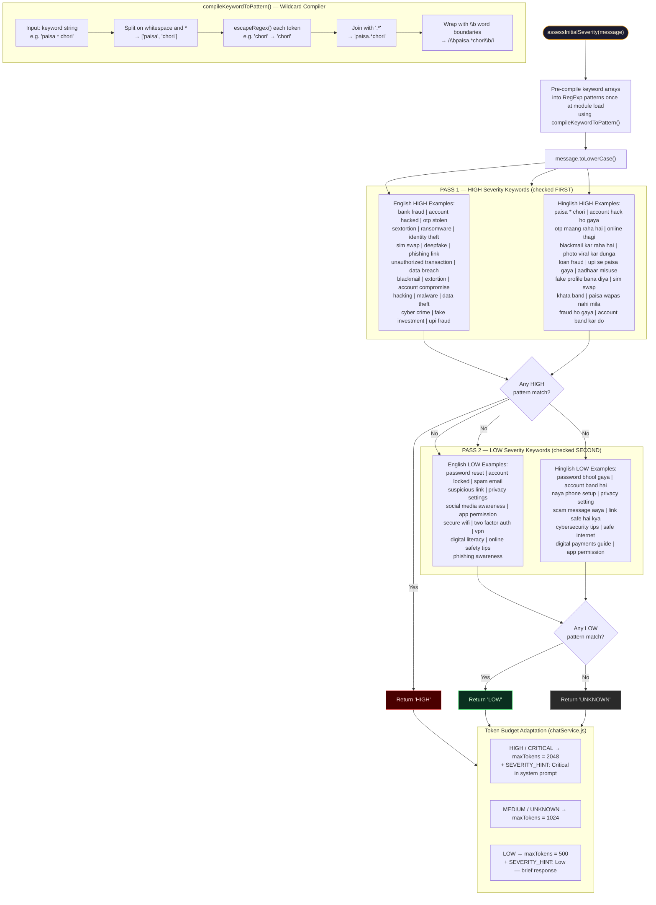

---

## Diagram 12 — LLM Provider Abstraction & Routing

**Name:** `ARCH-04 — LLM Provider Abstraction Layer & Interface Contract`  
**Purpose:** Shows the provider registry pattern, the standard interface each provider must implement, and how a single env variable change routes all LLM calls to a different provider.

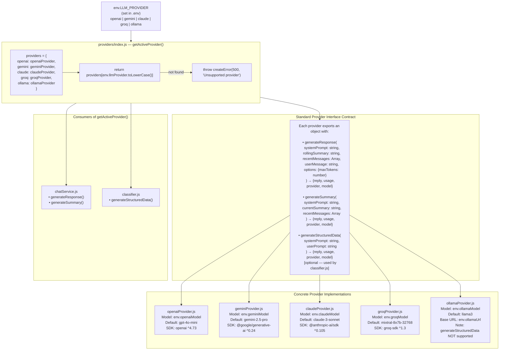

---

## Diagram 13 — PII Redaction Pipeline

**Name:** `ALGO-05 — PII Redaction Pipeline (11-Pattern Regex Engine)`  
**Purpose:** Documents every regex pattern applied to user-supplied data before it is forwarded to the LLM classifier, ensuring sensitive personal information never leaves the server unredacted.

```mermaid
flowchart TD
    IN(["redactSensitiveData(text)"])

    IN --> P1["Pattern 1: Credit Card Numbers\n/\\b(?:(?:\\d[ -]*?){13,19})\\b/g\n→ [REDACTED]"]
    P1 --> P2["Pattern 2: API Keys & Bearer Tokens\n/\\b(?:sk-[a-zA-Z0-9]{20,}|Bearer\\s+...)\\b/g\n→ [REDACTED]"]
    P2 --> P3["Pattern 3: Email Addresses\n/\\b[A-Za-z0-9._%+-]+@[domain]+\\b/g\n→ [REDACTED]"]
    P3 --> P4["Pattern 4: OTP / PIN / Password values\n/(?:otp|pin|password|cvv)[\\s:=]+[value]/gi\n→ 'otp [REDACTED]'"]
    P4 --> P5["Pattern 5: Aadhaar Numbers (12 digits)\n/\\b(?:\\d{4}[ -]?\\d{4}[ -]?\\d{4})\\b/g\n→ [REDACTED]"]
    P5 --> P6["Pattern 6: PAN Card Numbers\n/\\b[A-Z]{5}[0-9]{4}[A-Z]{1}\\b/gi\n→ [REDACTED]"]
    P6 --> P7["Pattern 7: Indian Mobile Numbers\n/\\b(?:\\+91|0)?[6-9]\\d{9}\\b/g\n→ [REDACTED]"]
    P7 --> P8["Pattern 8: IPv4 Addresses\n/\\b(?:\\d{1,3}\\.){3}\\d{1,3}\\b/g\n→ [REDACTED]"]
    P8 --> P9["Pattern 9: IPv6 Addresses\n/\\b(?:[a-fA-F0-9]{1,4}:){7}[a-fA-F0-9]{1,4}\\b/g\n→ [REDACTED]"]
    P9 --> P10["Pattern 10: UPI IDs\n/\\b[\\w.\\-_]{2,256}@[a-zA-Z]{2,64}\\b/g\n→ [REDACTED]"]
    P10 --> P11["Pattern 11: IFSC Codes\n/\\b[A-Z]{4}0[A-Z0-9]{6}\\b/gi\n→ [REDACTED]"]
    P11 --> P12["Pattern 12: Bank Account Numbers\n(context-prefixed: 'account|acct|a/c')\n→ prefix [REDACTED]"]
    P12 --> OUT(["Return redacted string\nwith [REDACTED] placeholders preserved\nfor LLM context continuity"])

    style IN fill:#1b1b2f,stroke:#f5a623,color:#fff4d6
    style OUT fill:#0f3460,stroke:#53d8fb,color:#d6f5ff
```

---

## Diagram 14 — Client-Side State & Session Persistence

**Name:** `ARCH-05 — Client-Side State Machine & sessionStorage Persistence`  
**Purpose:** Models the `useChat.js` hook as a state machine — showing all state variables, their initialization sources, and how every action mutates state and syncs to sessionStorage.

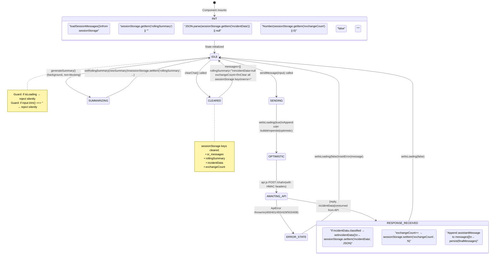

---

## Diagram 15 — Full End-to-End System Data Flow (Entity Relationship)

**Name:** `ER-01 — Full System Entity-Relationship & Data Transformation Map`  
**Purpose:** A high-altitude ER-style diagram showing every data entity in the system, how it is transformed as it flows from browser input to LLM output and back, and where each transformation occurs.

```mermaid
erDiagram
    USER_INPUT {
        string rawText "User-typed message (≤4000 chars)"
        string language "English or Hinglish"
        string timestamp "Browser time"
    }

    CHAT_PAYLOAD {
        string message "Trimmed input text"
        string rollingSummary "≤5000 chars compressed history"
        array recentMessages "Last 4 exchanges {role, text}"
        object incidentData "Whitelisted classification metadata"
        int exchangeCount "0–100 session counter"
    }

    HMAC_HEADERS {
        string X_API_Key "Shared secret"
        string X_Request_Timestamp "Unix epoch seconds"
        string X_Request_Signature "HMAC-SHA256 hex digest"
    }

    VALIDATED_PAYLOAD {
        string message "Type-checked, injection-scored"
        string rollingSummary "Capped at 5000 chars"
        array recentMessages "Capped at 10, each ≤2000 chars"
        object sanitizedIncidentData "Whitelist-filtered fields only"
        int exchangeCount "Validated 0–100 integer"
    }

    REDACTED_SUMMARY {
        string text "Original summary with 12 PII patterns replaced by [REDACTED]"
    }

    SEVERITY_RESULT {
        string level "HIGH | LOW | UNKNOWN"
        int maxTokens "500 | 1024 | 2048"
        string severityHint "Appended to system prompt"
    }

    LLM_CHAT_REQUEST {
        string systemPrompt "Sudarshan AI persona + severity hint"
        string rollingSummary "Redacted context"
        array messages "Conversation history"
        string userMessage "Current user message"
        int maxTokens "Severity-adapted"
    }

    LLM_CHAT_RESPONSE {
        string reply "AI guidance text (Markdown)"
        object usage "prompt_tokens, completion_tokens"
        string provider "Active provider name"
        string model "Active model name"
    }

    LLM_CLASSIFICATION_REQUEST {
        string systemPrompt "Classification-only prompt"
        string userPrompt "Redacted summary + recent messages"
    }

    LLM_CLASSIFICATION_RESPONSE {
        string category "One of 18 incident categories"
        string severity "Low|Medium|High|Critical"
        string risk "Low|Medium|High|Critical"
        string status "Open|Monitoring|Contained|Escalated|Resolved"
        int confidence "0–100"
    }

    INTELLIGENCE_PAYLOAD {
        bool classified "true if confidence ≥ 70"
        string category "Validated category string"
        string severity "From classifier"
        array immediateActions "From actionEngine.js"
        array evidenceChecklist "From evidenceEngine.js"
        array reportingGuidance "From reportingEngine.js"
        array relevantLaws "From lawMappingEngine.js (BNS/IT/DPDP/PROG)"
        string timestamp "ISO8601 server time"
    }

    API_RESPONSE {
        bool success "true on 200"
        object data "Contains reply + incidentData"
        string reply "LLM guidance text"
        object incidentData "Full intelligence payload"
    }

    SESSION_STATE {
        array messages "All rendered chat bubbles"
        string rollingSummary "Compressed session memory"
        object incidentData "Latest classification"
        int exchangeCount "Turn counter"
    }

    RENDERED_OUTPUT {
        string markdownText "react-markdown rendered"
        array sanitizedLinks "http:|https:|mailto: only"
        object investigationPanel "Actions/Laws/Evidence/Portals UI"
    }

    USER_INPUT ||--|| CHAT_PAYLOAD : "useChat.sendMessage()\npack + trim"
    CHAT_PAYLOAD ||--|| HMAC_HEADERS : "api.generateRequestSignature()\nWeb Crypto HMAC-SHA256"
    CHAT_PAYLOAD ||--|| VALIDATED_PAYLOAD : "validation.validateChatPayload()\ninjection score + whitelist"
    VALIDATED_PAYLOAD ||--|| REDACTED_SUMMARY : "redaction.redactSensitiveData()\n12 PII regex patterns"
    VALIDATED_PAYLOAD ||--|| SEVERITY_RESULT : "chatController.assessInitialSeverity()\nwildcard two-pass regex"
    SEVERITY_RESULT ||--|| LLM_CHAT_REQUEST : "chatService.getChatResponse()\nadapt maxTokens + systemPrompt"
    REDACTED_SUMMARY ||--|| LLM_CLASSIFICATION_REQUEST : "intelligenceService → classifier\nwrap in <user_input> tags"
    LLM_CHAT_REQUEST ||--|| LLM_CHAT_RESPONSE : "providers/index.generateResponse()\nOpenAI|Gemini|Claude|Groq|Ollama"
    LLM_CLASSIFICATION_REQUEST ||--|| LLM_CLASSIFICATION_RESPONSE : "providers/index.generateStructuredData()\nJSON-only output"
    LLM_CLASSIFICATION_RESPONSE ||--|| INTELLIGENCE_PAYLOAD : "intelligenceService.processIntelligence()\n4 local DB lookups"
    LLM_CHAT_RESPONSE ||--|| API_RESPONSE : "chatController assembles\nunified JSON response"
    INTELLIGENCE_PAYLOAD ||--|| API_RESPONSE : "merged into data.incidentData"
    API_RESPONSE ||--|| SESSION_STATE : "useChat processes response\nsetState + sessionStorage sync"
    SESSION_STATE ||--|| RENDERED_OUTPUT : "ChatMessage.jsx + InvestigationPanel.jsx\nlink sanitization + react-markdown"
```

---

## Summary of Diagrams

| ID | Name | Type | Layer |
|---|---|---|---|
| ARCH-01 | System Component Architecture | Graph | Full Stack |
| ARCH-02 | React Component Tree & Data Bindings | Graph | Frontend |
| ARCH-03 | Backend Module Dependency Graph | Graph | Backend |
| SEQ-01 | End-to-End Chat Message Sequence | Sequence | Full Stack |
| SEQ-02 | Rolling Summary Compression Pipeline | Sequence | Backend |
| FLOW-01 | Security Middleware Decision Chain | Flowchart | Gateway |
| ALGO-01 | Prompt Injection Detection & Scoring | Flowchart | Backend |
| ALGO-02 | Daily Budget Circuit Breaker State Machine | State Diagram | Middleware |
| ALGO-03 | HMAC-SHA256 Dual-Side Auth Algorithm | Flowchart | Full Stack |
| FLOW-02 | Intelligence Engine Pipeline | Flowchart | Intelligence |
| ALGO-04 | Severity Assessment & Wildcard Matcher | Flowchart | Backend |
| ARCH-04 | LLM Provider Abstraction Layer | Graph | Services |
| ALGO-05 | PII Redaction Pipeline | Flowchart | Backend |
| ARCH-05 | Client-Side State Machine | State Diagram | Frontend |
| ER-01 | Full System Entity-Relationship Map | ER Diagram | Full Stack |

---

*End of Technical Architecture Reference — Sudarshan AI (CyberRabbit v7.12.9)*
